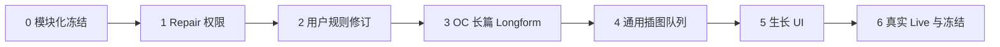

# NovelX 黑客松交互式世界生长完成执行计划

> **For Codex/Claude:** REQUIRED SUB-SKILL: use `executing-plans` to execute this plan task-by-task. Read `CONTEXT.md`, `src/agent-worker/growth/README.md`, `src/main/growth/README.md`, and only the current stage files before editing.

**Goal:** 完成可持续、可指导、可自询检查、可返工、可生成不少于 7,000 Unicode 字符的 OC 个人故事与来源绑定插图的交互式 Growth（生长）黑客松闭环。

**Architecture:** Main（主进程）持有 Goal/Cycle、Rule Revision（规则修订）、checkpoint（检查点）、Receipt（检索回执）、权限和副作用权威；Agent Worker（智能体工作线程）只处理当前阶段的高层创作输入；Domain（领域层）通过唯一 Change Set（变更集）提交正式修改；Renderer（渲染层）只投影已持久化的安全状态。实现按阶段模块串行推进，禁止继续把产品能力堆回顶层巨型状态机。

**Tech Stack:** Electron 43、React 19、TypeScript 6、SQLite、Vitest、Playwright、现有 Growth/Change Set/Graph Retrieval/Image Job/Asset 基础。

---

## 0. 文档权威与使用规则

本文件是当前黑客松 P0 的唯一执行状态权威。`docs/plans/2026-07-16-interactive-growth-illustration-p0.md` 保留需求、决策和历史设计，不再作为当前勾选进度源。

1. 默认单执行 Agent（智能体）串行工作；状态机、协议、迁移和全量测试不得并行。
2. 每次只进入一个阶段；上一阶段未完成验收和提交，不得开始下一阶段。
3. `[x]` 只表示代码、测试、文档和提交证据全部完成；存在回归时必须退回 `[ ]` 并标记 `regression`。
4. Mock（模拟）、Fixture（测试夹具）和受控 UI E2E 不能勾选真实 Provider（模型服务）Live（真实运行）。
5. 阶段 1–5 只运行定向测试、类型检查和必要构建；完整 `npm test` 只在阶段 6 的冻结头运行。
6. 未经新产品决策，不修改公开协议、Schema（数据库结构）、迁移、权限、Canon（正史）、Creator/Player Lens（创作者/玩家视角）或 A2.2 Runtime（运行时）冻结边界。
7. 不使用兼容垫片、隐藏降级、本地模板或确定性正文冒充真实 Agent。
8. 五份未跟踪 Player failure evidence（玩家失败证据）不属于本计划文件所有权，不删除、不修改、不提交。
9. 每个阶段完成后更新本文件的状态、提交哈希、测试数量和未完成边界，再进入下一阶段。

### 状态定义

| 状态 | 含义 |
| --- | --- |
| `not_started` | 尚未进入，复选框保持空白 |
| `in_progress` | 当前唯一执行阶段，阶段标题仍不打勾 |
| `blocked` | 已停止，记录首个真实阻塞和副作用边界 |
| `completed` | 阶段验收门全部通过并记录提交 |
| `regression` | 新证据推翻先前完成声明，必须重新打开 |

### 对话投影

每次向用户汇报时，从本文件重新渲染：

```text
黑客松执行进度：6/7 阶段已验收，剩余 1 阶段
[x] 0. 模块化基线与全量测试
[x] 1. Repair 权限与领域正确性
[x] 2. 用户规则影响分析与修订
[x] 3. OC 长篇 Longform 自动循环
[x] 4. 通用插图队列
[x] 5. 生长过程与图文图鉴 UI
[ ] 6. 真实 Live、打包与冻结验收
```

不显示主观百分比，只显示已验收阶段数、当前步骤、失败位置、测试证据和提交哈希。

---

## 1. 完成定义与明确排除

以下全部成立才可称黑客松交互式 Growth 完成：

- 用户可以用一句话、世界观、故事或 OC 作为种子。
- 用户可在运行中或完成后追加规则；规则先持久化，下一安全 Cycle 使用最新 revision。
- 每个内容 Cycle 先从 pinned checkpoint 图检索，再进行 Evidence-grounded Inquiry（证据化自询）。
- 世界、故事、OC 可以正推或逆推，而不是固定一次性 `world → story → oc`。
- 每个 Cycle 至多提交一个原子 Change Set；下一 Cycle 必须从新 checkpoint 重新检索。
- 独立 Checker（检查智能体）判断 Closure（闭环）；必要时进入受限 Repair（返工）。
- 焦点 OC 有稳定个人故事容器、详细档案和累计不少于 10,000 个 Unicode 字符的个人故事。
- 默认生成世界地图、世界风貌、故事场景和主要 OC 立绘；任意稳定文本或图谱节点可追加一张或多张来源绑定插图。
- UI 真实显示指导回执、推演摘要、影响对象、版本变化、插图状态和最终图文展台。
- 关闭重开后规则、内容、图谱、图片和进度仍可恢复；缺少 Provider 时失败关闭。
- 最终冻结头通过全量测试、生产构建、真实交互式 Live 和 Windows 打包验收。

本计划明确排除：Player（玩家模式）真实回合、小说提取、导出、移动端、赛后主线合并、A2.2/权限/Canon/Player Lens 扩建。

---

## 2. 当前冻结基线 [x]

**状态：** `completed`

- [x] 分支：`codex/hackathon-10day`。
- [x] 模块化维护头：`a666f077fa890bdf1a71d748f6145a6e718a7737`。
- [x] `GrowthPhaseHandler` 与阶段注册表已建立。
- [x] Longform 与 Closure/Repair Worker、Main authority resolver 已迁入阶段目录。
- [x] `story` / `volume` 关系语义集中于 `creativeRelationPolicy.ts`。
- [x] `npm test`：Unit 728/728、Integration 22/22、e2e-support 6/6，0 skipped。
- [x] `npm run typecheck` 通过。
- [x] `npm run build` 通过，并验证 3 组 active Prompt publication。
- [x] 未运行 Provider，未用历史 Live 证明当前代码。

历史真实边界：`gpt-5.4` 与 `gpt-image-2` 已完成一次性世界→故事→OC、世界地图、自动 Showcase（创作展台）和 research-only 检索。Cycle 间指导曾持久化 revision 2 并被后续 Cycle 使用，但 Story scope 图谱断言失败，交互式 Growth 未闭环。

---

## 3. 阶段依赖



阶段 2 是产品核心；阶段 3–5 不得绕过它先制造“看起来完成”的演示。

---

## 4. 阶段 1：Repair 权限与领域正确性 [x]

**状态：** `completed`
**目标：** Repair 只能修改 Checker finding 明确授权的真实对象，同时允许在两个已授权端点之间补建合法缺失关系。

### 文件所有权

**Create:**

- `src/main/growth/phases/closure/growthRepairTargetPolicy.ts`
- `tests/unit/growth-repair-target-policy.test.ts`

**Modify only when required:**

- `src/main/growth/phases/closure/growthClosureAuthorityResolver.ts`
- `src/main/growthRunLifecycle.ts`
- `src/domain/workspace/creativeRelationPolicy.ts`
- `src/domain/workspace/creativeRelationRepository.ts`
- `tests/unit/growth-run-bridge.test.ts`
- `tests/unit/growth-coordinator.test.ts`
- `tests/unit/workspace-agent-tool-gateway.test.ts`
- `tests/unit/creative-relation-repository.test.ts`
- `docs/adr/2026-07-16-hackathon-interactive-growth-and-illustration.md`

**Forbidden:** `src/shared/agentWorkerProtocol.ts`、Schema/迁移、Renderer、Prompt、Provider、图片模块。

### 权威边界

```ts
interface GrowthRepairAuthorizedTarget {
  kind: "resource" | "document" | "assertion" | "relation" | "constraint_profile";
  id: string;
  ownerResourceId: string | null;
  scopeResourceId: string | null;
}
```

模型 payload 的 owner、scope 和 relation endpoints 不能成为既有对象身份的权威。

### 实现步骤

1. [x] 未选中的 `documentId` 搭配已选中的 `payload.resourceId` 被既有跨组件回归拒绝。
2. [x] 未选中的 assertion/constraint profile 通过伪造 scope 换绑被既有跨组件回归拒绝。
3. [x] 只授权一个端点时创建 relation 被拒绝且零 Change Set 副作用。
4. [x] 两个端点都被 finding 选中且领域策略允许时，可创建缺失关系。
5. [x] 资源 type/objectKind/parent 换绑和非法 relation kind 由新策略测试拒绝。
6. [x] `growthRepairTargetPolicy.ts` 按 checkpoint 回查真实 owner/scope/endpoint。
7. [x] `growthRunLifecycle.ts` 的提案门禁调用阶段策略，不再自行解释对象身份。
8. [x] 从 `growthRunLifecycle.ts` 删除重复身份判断，只保留调用和终态门禁。
9. [x] 拒绝发生在 Change Set executor 前，正式对象、checkpoint、Change Set 数量不变。
10. [x] ADR 与 Main Growth 路由已更新。

### 定向验收

```powershell
npx --no-install vitest run --config vitest.config.ts tests/unit/growth-repair-target-policy.test.ts tests/unit/growth-run-bridge.test.ts tests/unit/growth-coordinator.test.ts tests/unit/workspace-agent-tool-gateway.test.ts tests/unit/creative-relation-repository.test.ts
npm run typecheck
npm run verify:prompt-publication
git diff --check
```

- [x] 6 个定向文件、93/93 通过、0 skipped。
- [x] active Prompt 身份不变。
- [x] ID/owner/scope/parent 换绑和合法补关系均有回归。
- [x] 越权路径零副作用。
- [x] 暂存文件逐项审查。
- [x] 提交：`410fea7 fix(growth): enforce repair target authority`。

**停止条件：** 需要修改公开协议、Schema、权限、Canon，或 finding 无法唯一解析对象身份。

**完成证据：** Commit `410fea7`；Vitest 6 files / 93 passed / 0 skipped；typecheck、Prompt publication、diff check passed；未运行 Provider。阶段 2 仍未开始。

---

## 5. 阶段 2：用户规则影响分析与修订 [x]

**状态：** `completed`
**目标：** 用户保存新规则后，下一安全 Revision Cycle（修订轮）从最新 checkpoint 重新检索，分析受影响节点，并用一个原子 Change Set 修改世界、故事、OC 与关系。

### 文件所有权

**Create:**

- `src/agent-worker/growth/phases/revision/growthImpactBrief.ts`
- `src/agent-worker/growth/phases/revision/growthRevisionFragment.ts`
- `src/agent-worker/growth/phases/revision/growthRevisionPhase.ts`
- `src/main/growth/phases/revision/growthRevisionAuthorityResolver.ts`
- `tests/unit/growth-impact-brief.test.ts`
- `tests/unit/growth-revision-fragment.test.ts`
- `tests/unit/growth-revision-phase.test.ts`
- `tests/unit/growth-revision-authority.test.ts`

**Modify only when required:**

- `src/agent-worker/growth/core/growthPhaseRegistry.ts`
- `src/agent-worker/stewardExecutionStateMachine.ts`
- `src/main/growthCoordinator.ts`
- `src/main/growthRunLifecycle.ts`
- `src/domain/growth/growthRepository.ts`
- `src/main/workspaceAgentToolGateway.ts`
- `src/renderer/src/features/agent/growthPresentation.ts`
- `src/renderer/src/features/agent/RunActivityTimeline.tsx`
- `src/renderer/src/features/activity/RunWorkTargetPane.tsx`
- 相邻 Growth/Guidance/State Machine/Gateway 测试。

**Forbidden:** 新迁移、公开 Provider 协议、A2.2、Canon、Player Lens、图片调用。

### 模型可见输入

```ts
interface GrowthImpactBrief {
  summary: string;
  targets: Array<{
    evidenceId: string;
    decision: "revise" | "preserve" | "stale_visual";
    reasonSummary: string;
  }>;
  additions: Array<{
    kind: "world" | "location" | "faction" | "story" | "oc" | "document" | "assertion" | "relation";
    reasonSummary: string;
  }>;
}
```

模型不能提供 checkpoint、branch、scope、expected head、owner、数据库 ID 或权限字段。

### 实现步骤

1. [x] 严格 schema 测试：未知 evidence、重复目标、空摘要、伪造权限字段失败关闭。
2. [x] Revision Fragment 测试：创作内容来自模型；ID、owner、版本、来源和依赖由编译器产生。
3. [x] 跨领域测试：一条规则在同一 Change Set 更新 world、story、OC 和关系。
4. [x] preserve 测试：未选择修改的用户事实保持字节不变。
5. [x] stale 测试：来源变化只登记受影响图片，不污染无关 Asset。
6. [x] 实现 Revision handler：`retrieve → inquiry → impact → propose`。
7. [x] 注册 handler；Revision 的模型工具、authority 状态、编译与纠正留在阶段私有 runtime。
8. [x] Main resolver 从最新 revision、Receipt 和 checkpoint 映射权威对象。
9. [x] Coordinator 仅在安全终态后创建一个 revision Intent。
10. [x] 连续指导保留全部 revision 审计；下一轮使用最新 revision 合并处理。
11. [x] Change Set 失败即停止；结果未知进入 `reconciliation_required`，不得重提。
12. [x] 发布安全影响摘要，不发布原始思维链。
13. [x] UI 区分“已保存”“等待边界”“正在分析”“已修改”。
14. [x] 覆盖重开、取消、CAS 冲突、重复请求和终态事件恰好一次。
15. [x] 固定示例：“轻小说叙事风格、无真实日本元素、原创西幻世界”。

### 定向验收

```powershell
npx --no-install vitest run --config vitest.config.ts tests/unit/growth-impact-brief.test.ts tests/unit/growth-revision-fragment.test.ts tests/unit/growth-revision-phase.test.ts tests/unit/growth-revision-authority.test.ts tests/unit/growth-phase-registry.test.ts tests/unit/steward-execution-state-machine.test.ts tests/unit/growth-coordinator.test.ts tests/unit/growth-guidance-ipc.test.ts tests/unit/growth-run-bridge.test.ts tests/unit/growth-presentation.test.ts tests/unit/workspace-agent-tool-gateway.test.ts
npm run typecheck
npm run verify:prompt-publication
git diff --check
```

- [x] 最新 Rule Revision 只在 Cycle 边界生效。
- [x] Revision Cycle 必须重新检索。
- [x] world/story/OC 可在一个 Change Set 中共同修改。
- [x] preserve、失败、取消、重开和结果未知通过。
- [x] UI 不提前显示规则已应用。
- [x] 提交：`3a39df5 feat(growth): revise graph-backed content from new rules`。

**停止条件：** 内部 binding 无法安全表达 authority、需要不兼容协议/迁移，或问题需要创作者价值取舍。

**完成证据：** Commit `3a39df5`；Vitest 11 files / 146 passed / 0 skipped；typecheck、Prompt publication、diff check passed。未运行真实 Provider、Electron、生产构建或全量测试；当前只证明 Revision 的确定性闭环，真实交互式 Live 留到阶段 6。

---

## 6. 阶段 3：OC 长篇 Longform 自动循环 [x]

**状态：** `completed`
**目标：** 为焦点 OC 创建或恢复个人故事 `volume`，逐节检索、写作和提交，累计至少 10,000 个 Unicode 字符后交给 Closure/Checker 复检。

### 文件所有权

**Create:**

- `src/main/growth/phases/longform/growthLongformCoordinator.ts`
- `tests/unit/growth-longform-coordinator.test.ts`

**Modify only when required:**

- `src/agent-worker/growth/phases/longform/growthLongformPhase.ts`
- `src/main/growth/phases/longform/growthLongformAuthorityResolver.ts`
- `src/domain/growth/growthLongformProgress.ts`
- `src/agent-worker/growth/growthLongformOutline.ts`
- `src/agent-worker/growth/growthLongformSection.ts`
- `src/main/growthCoordinator.ts`
- `src/main/growthRunLifecycle.ts`
- `src/domain/growth/growthRepository.ts`
- 相邻 Longform/Closure/Coordinator 测试。

**Forbidden:** 主线 prose 冒充 OC 个人故事、一次请求生成全部长篇、无检索连续写、模板正文、padding。

### 实现步骤

1. [x] 无 outline 时只创建 outline Cycle，不同时写 section。
2. [x] 每个 section 有独立 Run、Receipt、Change Set 和 output checkpoint。
3. [x] 第 N 节从第 N-1 节提交后的 checkpoint 重新检索。
4. [x] 只累计个人 `volume` 当前稳定 prose；主线、superseded、working copy 不计入。
5. [x] 相同 section intent 复用既有 Goal/Cycle/Run 幂等与单副作用门禁，不重复 Change Set。
6. [x] 复用已验收的取消、超时、重开和 reconciliation 生命周期门禁。
7. [x] 实现 `growthLongformCoordinator.ts`，只决定 outline、next section、recheck 或 terminal。
8. [x] `growthCoordinator.ts` 只注册/调用；Longform 进度与提案规则留在阶段目录。
9. [x] outline 提交后解析稳定 identity；每节输入只含 pinned evidence、outline、已完成摘要和当前 objective。
10. [x] Writer candidateText 原字节进入一个稳定 prose 文档。
11. [x] 不足 10,000 时创建下一节；达到后创建独立 Closure evaluation Cycle。
12. [x] Checker 要求返工时复用阶段 1 Repair；accepted 后才结束 OC Saga。
13. [x] 无字符进展、跳节、低于 10,000 的伪终态和重复 finding 均失败关闭。

### 定向验收

```powershell
npx --no-install vitest run --config vitest.config.ts tests/unit/growth-longform-coordinator.test.ts tests/unit/growth-longform-phase.test.ts tests/unit/growth-longform-authoring.test.ts tests/unit/growth-longform-progress.test.ts tests/unit/growth-run-bridge.test.ts tests/unit/growth-coordinator.test.ts tests/unit/growth-closure-evaluator.test.ts tests/unit/growth-closure-phase.test.ts
npm run typecheck
npm run verify:prompt-publication
git diff --check
```

- [x] outline→section→checkpoint→next section 调度闭合。
- [x] 每节重新检索且只有一个 Change Set。
- [x] 10,000 字符边界与 Closure recheck 通过。
- [x] 取消、超时、重开和幂等通过。
- [x] 顶层只增加阶段委派和可信副作用门禁；进度决策与重编译策略位于阶段目录。
- [x] 提交：`089ee99 feat(growth): orchestrate oc longform closure`。

**停止条件：** 需要新 Schema 保证幂等/恢复，或 Writer 输出无法绑定 outline/Receipt。

**完成证据：** Commit `089ee99`；Vitest 10 files / 132 passed / 0 skipped；`npm run typecheck`、`npm run verify:prompt-publication`、`git diff --check` 通过。跨组件回归证明 outline、两个各 5,000 Unicode 字符的独立 section、连续 checkpoint、最终 Closure recheck 与 accepted；另证明第一节运行中追加 Rule Revision 后，先完成旧版本原子提交，再执行重新检索的 Revision 和独立 recheck，最后才以新规则写第二节。未运行真实 Provider、Electron、生产构建或全量测试；真实 Longform Live 留到阶段 6。

---

## 7. 阶段 4：通用插图队列 [x]

**状态：** `completed`
**目标：** 默认补齐地图、世界风貌、故事场景和主要 OC 立绘，并允许任意稳定文本或图谱节点请求任意数量的来源绑定插图。

### 文件所有权

**Create:**

- `src/main/growth/illustration/growthIllustrationCoordinator.ts`
- `src/main/growth/illustration/growthIllustrationRecovery.ts`
- `tests/unit/growth-illustration-coordinator.test.ts`

**Modify only when required:**

- `src/agent-worker/growth/growthIllustrationPlan.ts`
- `src/domain/growth/growthVisualStylePolicy.ts`
- `src/domain/growth/growthRepository.ts`
- `src/domain/asset/imageAssetRepository.ts`
- `src/domain/asset/imageGenerationService.ts`
- `src/main/workspaceAgentToolGateway.ts`
- `src/main/agentProcessSupervisor.ts`
- 相邻 Illustration/Image 测试。

**Forbidden:** Renderer 直接调用 Provider、产品总量硬上限、无来源图片、旧图错误显示 current ready、结果未知自动重试收费。

### 默认选择

- 世界地图 1 张；主要国家/地区/地点/势力至少 1 张代表性风貌图。
- 故事至少 1 张背景或关键场景图。
- 每个主要 OC 默认 1 张角色立绘。
- 重要物品、怪物、遗迹、建筑和魔法现象按叙事重要性选择。
- 用户要求“每节点一图”“多变体”时不以产品配额拒绝；内部批次默认 20、并发默认 1。

### 实现步骤

1. [x] 只读审计现有 illustration 表和 repository API；未重复建表。
2. [x] 默认选择测试覆盖地图、风貌、场景和角色立绘。
3. [x] anchor 测试覆盖 resource、stable text span、working/conversation immutable snapshot。
4. [x] 10、100、105 个 items 均可分页；每批最多 20，无 Request 总量上限。
5. [x] 幂等键相同只产生一个 Job。
6. [x] source version 改变后旧 Item 与 Asset 同时 stale，但保留可回看。
7. [x] 重开恢复 planned/queued/running/ready/failed/cancelled/reconciliation。
8. [x] Provider 结果未知进入 reconciliation，不自动再次收费。
9. [x] Coordinator 在一个 SQLite 事务中持久化完整计划，再执行第一项；第二批失败全回滚。
10. [x] 每项继续通过现有 `generate_image` Gateway 和 Job/Asset 权威链。
11. [x] 默认风格为成熟漫画＋手绘；除非用户覆盖，避免写实、3D、chibi、kawaii 和通用萌系。
12. [x] 图片事实只来自 source versions；单项失败不丢后续项。

### 定向验收

```powershell
npx --no-install vitest run --config vitest.config.ts tests/unit/growth-illustration-coordinator.test.ts tests/unit/growth-illustration-plan.test.ts tests/unit/growth-visual-style-policy.test.ts tests/unit/image-asset-repository.test.ts tests/unit/image-generation-service.test.ts tests/unit/image-workspace-recovery.test.ts tests/unit/workspace-agent-tool-gateway.test.ts
npm run typecheck
npm run verify:prompt-publication
npm run build
git diff --check
```

- [x] 默认视觉集合完整规划。
- [x] 任意文本/节点支持一张、多张和多变体。
- [x] 无产品总量硬上限，内部批次 20、并发 1。
- [x] stale、恢复、取消、部分失败、结果未知通过。
- [x] 提交：`6ed78e2 feat(growth): queue source-bound illustrations`。

**停止条件：** 现有 Schema 无法表达锚点/幂等/reconciliation，或需要修改 Provider 公开协议/权限。

**完成证据：** `6ed78e2`；9 个定向 Vitest 文件 106/106、0 skipped；`npm run typecheck`、`npm run verify:prompt-publication`、`npm run build`、`git diff --check` 均通过。未运行真实 Provider、Renderer E2E 或全量测试；本阶段只证明 Main/SQLite/Gateway 的通用队列权威，UI 接入和真实多图 Live 留到阶段 5/6。

---

## 8. 阶段 5：生长过程与图文图鉴 UI [x]

**状态：** `completed`
**目标：** 中央对话流展示可展开的安全推演过程，右栏展示真实编辑对象，展台以“文字＋图片＋图谱”呈现世界生长结果。

**历史阻塞（2026-07-16，已解决）：** Renderer（渲染层）接入前的只读审计证明，当时生产入口只有
`growth.start/get/guide/subscribe`；`GrowthIllustrationCoordinator` 只在确定性测试中实例化，未被 Main
生产路径调用。`growth.get` 也未投影插图 Request/Batch/Item、Longform 当前章节与累计字符、Closure
finding/repair target 等安全持久状态。该边界已由下面的产品决定和 `growth-presentation-v1` 安全投影解决，
未从日志猜测状态，也未把 Domain 内部 Schema 直接暴露给 Renderer。

**产品决定（2026-07-16）：** 产品负责人已授权版本化、Creator-only 的内部 Growth Renderer IPC，范围仅限
读取安全 Longform/Closure/Illustration 投影，以及创建、取消来源绑定插画请求；仍禁止修改数据库 Schema、
Provider 协议、权限、Canon、Creator/Player Lens 或 A2.2。Renderer 不得接收 Prompt、工具参数、凭证、
原始思维链、locator、磁盘路径或未授权正文。

### 文件所有权

**Create:**

- `src/renderer/src/features/growth/GrowthGuidanceStatus.tsx`
- `src/renderer/src/features/growth/GrowthImpactSummary.tsx`
- `src/renderer/src/features/growth/GrowthIllustrationGallery.tsx`
- `tests/unit/growth-guidance-status.test.ts`
- `tests/unit/growth-illustration-gallery.test.ts`

**Modify only when required:**

- `src/renderer/src/features/agent/StewardRuntimePanel.tsx`
- `src/renderer/src/features/agent/RunActivityTimeline.tsx`
- `src/renderer/src/features/agent/growthPresentation.ts`
- `src/renderer/src/features/activity/RunWorkTargetPane.tsx`
- `src/renderer/src/features/activity/ProjectActivityPanel.tsx`
- `src/renderer/src/features/showcase/CreativeShowcase.tsx`
- `src/renderer/src/App.tsx`
- `src/renderer/src/styles/base.css`
- `tests/unit/growth-presentation.test.ts`
- `tests/e2e/growth-presentation-ui.spec.ts`
- `tests/e2e/creative-showcase.spec.ts`

**Forbidden:** 从日志猜状态、显示原始思维链/Prompt/工具参数/凭证、committed 前显示“已写入”、failed/stale 播放 ready 动画。

### 实现步骤

1. [x] 安全 event/Artifact/snapshot 纯投影测试，乱序/重复确定性去重。
2. [x] 指导保存后显示 revision 和“等待安全边界”，不得显示已应用。
3. [x] Revision Cycle 显示影响对象种类、数量和 durable state。
4. [x] Inquiry 只显示 selected question 安全摘要和持久化事件来源。
5. [x] Closure/Repair 显示 Checker finding、返工目标和复检结果。
6. [x] Longform 显示故事标题、当前 section、累计字符和闭环复检状态。
7. [x] 插图卡显示 source text、状态、变体和受管 thumbnail；只有 ready 可打开。
8. [x] 正式对象、图谱节点和任意文本片段提供来源绑定配图、节点再生成和最多 100 个变体，走 Main 持久请求。
9. [x] 图谱节点只投影 committed 数据，挂载动画不提前创造节点或状态。
10. [x] Showcase 分区为地图、世界风貌、故事场景、OC 卡与立绘、重要细节、关系图谱。
11. [x] 遵守 `prefers-reduced-motion`；动画只延迟权威事件。
12. [x] 覆盖 scope 切换、重载、失败/阻塞、100 项分页和局部图片失败。

### 定向验收

```powershell
npx --no-install vitest run --config vitest.config.ts tests/unit/growth-presentation-projector.test.ts tests/unit/growth-illustration-coordinator.test.ts tests/unit/growth-illustration-plan.test.ts tests/unit/growth-repository.test.ts tests/unit/growth-coordinator.test.ts tests/unit/ipc-contract.test.ts tests/unit/semantic-graph-service.test.ts tests/unit/growth-guidance-ipc.test.ts tests/unit/growth-guidance-status.test.ts tests/unit/growth-illustration-gallery.test.ts tests/unit/growth-presentation.test.ts tests/unit/creative-showcase-grouping.test.ts
npm run typecheck
npm run build
npx --no-install playwright test tests/e2e/growth-presentation-ui.spec.ts tests/e2e/creative-showcase.spec.ts --workers=1 --retries=0
git diff --check
```

- [x] 中央摘要和右栏对象来自 Main 权威投影与持久化事件。
- [x] committed 前不显示完成；failed/stale 不伪装 ready。
- [x] 任意文本/节点配图入口走 Main；Renderer 不提供 scope/checkpoint/权限字段。
- [x] 重载、scope、reduced motion、大列表通过。
- [x] Electron 残留为 0。
- [x] 提交：`3663d96 feat(growth): present source-bound illustrated progress`。

**停止条件：** UI 所需状态只能通过猜测/内部日志获得，或内容读取要求扩大 Lens/权限。

**完成证据：** Commit `3663d96`；定向 Vitest 12 files / 142 passed / 0 skipped；`npm run typecheck`、
三组 Prompt publication、`npm run build`、`git diff --check` 通过；Electron E2E 2 files / 5 passed，
残留进程 0。未使用真实 Provider；E2E 只证明受控 UI、真实 SQLite/IPC 投影与缺少 Provider 时失败关闭。
真实多轮指导、Longform、图片与重开 Live 仍由阶段 6 唯一验收。

---

## 9. 阶段 5.5：自动默认配图接线 [ ]

**状态：** `completed`
**目标：** 补齐阶段 4 只完成队列能力、但未接入自动 Growth 主链的缺口；在最终 Closure accepted 后，依据最终 checkpoint 自动选择世界风貌、故事场景和主要 OC 立绘，幂等进入既有来源绑定队列。既有 world_map 继续作为地图覆盖，不重复生成。

### 边界与不变量

- Main 只从 accepted Closure、最终 checkpoint、授权 scope 和当前正式资源派生默认目标；Renderer 和模型不能提供 authority。
- 确定性代码只选择目标并给出固定构图任务，不创造世界事实；图片内容由真实 Image Provider 基于来源证据生成。
- 默认覆盖所有当前主要 OC、故事，以及地点/势力风貌；不设产品总量上限，用户仍可继续为任意稳定文本或图谱节点追加任意数量插图。
- Request ID、Item ID 和 Job idempotency key 稳定；重复 `growth.get`、重开或事件重放不得二次收费。
- Provider 缺失、失败或结果未知必须分别进入 failed/reconciliation，不能生成本地替代图。
- 新实现位于 `src/main/growth/illustration/` 阶段目录；不得继续扩张 Worker 顶层状态机、`growthRunLifecycle.ts`、公开协议或数据库 Schema。

### 文件所有权

- `src/main/growth/illustration/growthDefaultIllustrationPlan.ts`（新）
- `src/main/growth/illustration/growthIllustrationApplicationService.ts`
- `src/main/growthCoordinator.ts`（仅 accepted 后一次委派）
- `src/main/growth/illustration/README.md`
- 相邻默认规划、Coordinator、恢复与投影测试
- 本计划状态与证据字段

### 验收

- [x] 默认目标至少覆盖一个地点/势力风貌、一个故事场景和每个主要 OC 立绘；世界地图由既有 ready world_map 覆盖。
- [x] accepted 前不创建 Request；accepted 后恰好一个默认 Request。
- [x] 重放与重开不产生第二 Request、Item、Job 或 Provider 调用。
- [x] 部分失败不丢后续项；结果未知不自动重试收费。
- [x] `growth-presentation-v1` 能投影自动 Request，用户追加自由配图路径不回归。
- [x] 定向 Vitest、typecheck、Prompt publication、build、diff check 与无 Provider 失败关闭通过。

**停止条件：** 需要新公开协议、Schema、权限、A2.2 变更，或只能由测试脚本/Renderer 伪造自动队列。

**完成证据：** Commit `76dba6a`；自动规划只读取本 Goal 已提交 Change Set 的当前
`resource_revision` outputs，并把最终世界设定作为每项只读上下文，不扫描同项目无关对象。定向 Vitest
13 files / 142 passed / 0 skipped；`npm run typecheck`、三组 Prompt publication、`npm run build`、
`git diff --check` 通过；Electron E2E 2 files / 5 passed，残留进程 0。未使用真实 Provider；真实多图
ready、重开和计费幂等留到阶段 6 唯一 Live。

---

## 10. 阶段 6：真实 Live、打包与冻结验收 [ ]

**状态：** `blocked`
**目标：** 在冻结代码上证明真实交互式世界生长、不少于 7,000 Unicode 字符的 OC 故事、多图生成、重开恢复和 Windows 可运行包。

### 文件所有权

- `tests/e2e/real-provider-interactive-growth.spec.ts`
- `tests/e2e/support/growthWatcher.ts`（仅确定性测试基础设施缺陷）
- `notes/evidence/novax-desktop-growth/` 下新增一份脱敏证据。
- `notes/status/2026-07-16-hackathon-interactive-growth-final.md`
- `docs/project/current-state-and-routes.md`
- 本计划状态与证据字段。

**Forbidden:** Live 后降低断言、改 Prompt/生产逻辑、重试 Provider、用 Mock 替代真实结果。

### 冻结前集中验收

```powershell
git diff --check
npm run typecheck
npm test
npm run build
npx --no-install playwright test tests/e2e/growth-presentation-ui.spec.ts tests/e2e/creative-showcase.spec.ts --workers=1 --retries=0
```

- [x] 工作树只含冻结范围，Player evidence 未触碰。
- [x] 全量测试通过、0 skipped（Unit 767、Integration 22、e2e-support 6，共 795）。
- [x] typecheck/build/三组 Prompt publication 通过。
- [x] 无 Provider 失败关闭 UI E2E 通过（5/5）。
- [x] Electron/Playwright 残留为 0。

### 唯一真实交互式 Live

```powershell
$env:NODE_USE_ENV_PROXY = "1"
npx --no-install playwright test tests/e2e/real-provider-interactive-growth.spec.ts --workers=1 --retries=0
```

必须证明：

1. [x] UI 一次输入任意种子启动 Growth。
2. [x] 世界 Cycle 真实检索、Inquiry、Change Set 和 checkpoint 提交。
3. [x] 运行中输入：“日式指轻小说叙事风格，不出现真实日本元素，世界仍为原创西幻。”
4. [x] UI 显示 revision 已持久化但尚未应用。
5. [x] 下一安全 Cycle 固定新 revision、重新检索并产生 Impact Brief。
6. [ ] Revision Change Set 保留并修改当时已经存在的世界对象；尚未存在的故事、OC 与关系必须在后续 Cycle 中按 revision 2 创建并持续使用该规则。不得把不存在的对象伪称为已被即时修改。
7. [ ] Checker 给出 accepted 或 repairs_required；返工后重新检索复检。
8. [ ] 焦点 OC 个人故事累计至少 10,000 Unicode 字符并有完整来源。
9. [ ] 默认地图、风貌、场景、主要 OC 立绘进入队列并 ready；额外文本/节点插图可创建。
10. [ ] 中央流、右栏、图谱和图文展台显示真实状态。
11. [ ] 重开后 revision、Cycle、Change Set、checkpoint、文档、关系、Job、Asset 和图谱一致。
12. [ ] research-only Run 重新检索且不新增 Change Set/图片/checkpoint。
13. [x] leak scan 不含凭证、Prompt、参数、原始思维链、locator 或未授权正文。

首次失败必须保存首个可操作失败和副作用边界并停止，不得盲目重跑。

**2026-07-16 第一次 Live 结果：** `blocked`。真实 Provider 进程已启动，但 E2E 仍定位旧按钮
“保存到下一轮”；当前 Renderer 的真实按钮为“保存规则修订”。因此运行在任何模型回执、检索、Change Set
或图片调用前以 `GROWTH_GUIDANCE_CYCLE_ONE_WINDOW_MISSED` 停止。Cycle 1 在关闭时进入
`reconciliation_required / GROWTH_RUN_INTERRUPTED`；正式资源、文档、断言、关系、Change Set、图片均为 0。
失败证据：`notes/evidence/novax-desktop-growth/growth-guidance-live-2026-07-16T14-17-18-079Z.json`，
SHA-256 `6C57EADD3E1DC53B9D71A4DC14F558AF44B0EEC19DC2D312006A05BACC87B2EF`；PowerShell/Node
双解析与 leak scan 均通过。按停止条件未修 Harness、未重跑 Provider，Windows 打包未开始。

**产品负责人授权的第二次 Live：** 旧按钮已迁移为“保存规则修订”，无 Provider 指导 UI 3/3 通过。
新运行真实保存 revision 2；Cycle 1 committed 且世界地图 ready，Cycle 2 使用 revision 2 重新检索后
以 `GROWTH_CHANGE_SET_NOT_COMMITTED` blocked，没有成功 proposal 或第二个 Change Set。Coordinator 为
blocked，Showcase 未打开；当次 E2E 表面首失败为 `AUTO_SHOWCASE_NOT_OBSERVED`。复核确认旧 Harness 对非 completed
终态仍等待 Showcase，因而遮蔽了真实 Coordinator blocked；现已改为只有权威 `completed` 才运行原有视觉高潮断言。
当前最高证据为
`growth-guidance-live-2026-07-16T15-07-02-921Z.json`，SHA-256
`D5307157EC41DDA10373060D0CA1568C28A099F0D42644A8B749741D77EAEF0E`；双解析与 leak scan 通过。
没有 Cycle 3、Closure、Longform、默认/自由插图、重开或 research 验收；未打包、未再次重跑。

**无 Provider 安全诊断：** E2E 支持层现从既有 public terminal conflict Artifact 中仅投影固定 block code，
并在 SQLite 安全边界记录 Receipt link 数；不记录 message、evidence ID、正文或参数。状态机/Worker 52/52、
Harness 8/8、typecheck、Prompt gate 与 diff check 通过，生产代码和协议未改。Harness 已证明非 completed 终态
不再进入 Showcase 等待，且 completed 路径的视觉断言保持原样。下一次 Live 若再次在 proposal
前 blocked，可区分 `user_confirmation_required` 与 `missing_source`，并用 link 数判断检索是否为空。

**产品负责人授权的第三次、唯一 Live：** 新 Harness 正确以 `GROWTH_COORDINATOR_TERMINAL_NOT_COMPLETED`
报告真实终态。Cycle 1 committed/map ready；Cycle 2 固定 revision 2，Receipt 14 links，retrieve 与 Inquiry
选择已持久化，随后以 allowlisted `tool_failed` blocked；无成功 proposal、第二个 Change Set 或 output checkpoint。
因此已经排除空检索和 Creator Choice；当前证据只支持定位到 Inquiry 后、Change Set executor 前的 Revision
Fragment/工具边界，不能推断具体私有编译码。证据
`growth-guidance-live-2026-07-16T15-41-18-710Z.json`，SHA-256
`C7F69602CF5833EC199484E6B3969757041DAE69FE7A6E028F39234AAB1E441E`；PowerShell/Node 双解析与 leak scan 通过。
按停止条件未修改生产逻辑、Prompt 或断言，未重跑 Provider。

**确定性诊断与局部修复：** 经产品负责人授权后，上游 `pi-agent-core` 源码与红色回归共同证明：工具抛错时
模型只看到 `Error.message`，而 Revision 编译器原先把八类可纠正错误全部压成同一句泛化消息；状态机的两次
零副作用修正因此缺少具体方向。Revision 阶段现以固定 allowlist 文案分别说明 authority、impact、reference、
relation 等修正要求，并在首次工具描述中显式声明 revise/preserve/stale_visual、addition multiset 和引用种类不变量。
没有放宽 Schema、领域策略、authority、重试次数或验收门槛。定向 6 files / 71 tests 全通过，typecheck、三组
Prompt gate、build、diff check 与 Electron 残留检查通过。该结果只证明盲重试缺陷已修复；尚未运行新的 Provider
Live，不能反推历史私有错误码，也不能把阶段 6 标为完成。

**修复后的第四次、唯一 Live：** `openai-compatible / gpt-5.4` 与
`openai-compatible-image / gpt-image-2` 均真实启动。Cycle 1 文本 Change Set committed，但地图
`IMAGE_GENERATION_FAILED`（Job 1、Asset 0）；Cycle 2 固定 revision 2，Receipt 8 links，retrieve、Inquiry 和
`propose_change_set` 均 succeeded，证明 Revision Fragment 修复越过了原编译前边界。提案却只形成一个
`pending` Change Set，无 Cycle 绑定或 output checkpoint，最终 `GROWTH_CHANGE_SET_NOT_COMMITTED` blocked。
安全证据 `growth-guidance-live-2026-07-16T16-08-36-144Z.json`，SHA-256
`11EF515F3F6F03955229F73F36374E746A782F3AF2B84704A9A7A3981B24A3B8`；PowerShell/Node 双解析、leak scan
和残留进程检查通过。按停止条件未修改 Policy、Coordinator、Prompt 或验收门槛，未重跑 Provider。

只读检查确定新的合同冲突：Revision 编译器和 Main pinned authority 允许 `resource.put(create=false)` 与
现有 identity 的 `assertion.put`，而 `WorkspaceChangeSetPolicy` 将前者固定评为 elevated，并会因后者的
same-identity warning/major 将其评为 elevated；`ChangeSetService` 只自动提交全 low-risk 的 Free Change Set。
安全证据不含具体 item/gate reason，故不能声称本次由哪一种更新触发。产品负责人于 2026-07-17 决定：Free 是
用户直接放权，合法 Change Set 不再进入人工审查；risk 只保留审计，重大冲突、越权、过期 checkpoint、领域校验和
事务失败仍失败关闭。本地实现已删除 elevated 风险触发的 review 分支；历史 pending 证据保持原样，新的真实 Live 才能证明提交闭环。

### Windows 打包与重开

```powershell
npm run package:dir
npm run verify:package
npm run package:win
npm run verify:installer
```

- [x] 解包目录可启动并退出。
- [x] NSIS 安装包通过验证。
- [ ] 安装后打开已有 workspace，规则、文本、图片和图谱仍可读取。
- [x] 不误读测试 userData；残留进程为 0。

**2026-07-16 打包结果：** `npm run package:dir` 与 `npm run verify:package` 通过。仓库验证器已启动/退出
`release\win-unpacked\novelx.exe`，验证 packaged Worker、Preload（预加载桥）、Windows 平台、无 workspace
启动和内部文本不泄漏；包内 17,889 entries，`app.asar` 116,170,082 bytes。`npm run package:win` 成功生成
`release\novelx-Setup-0.2.7-x64.exe`（121,009,169 bytes，SHA-256
`62E45425D6BF449E6FFA36124B1E7372C83B45D210F344DCFCA091399CB86C64`）。安装器和解包应用当前均为
`NotSigned`，不得声称代码签名通过。

`npm run verify:installer` 首次在任何测试安装前 fail closed：检测到用户已有正式安装
`D:\NovelX\Uninstall novelx.exe /currentuser`。产品负责人随后确认旧安装没有需保留的数据并明确授权覆盖；
官方卸载器静默退出 0 后，`verify:installer` 通过隔离安装、双启动、卸载、应用移除和用户数据保留。当前
0.2.7 已重新安装到 `D:\NovelX`，并用隔离 userData 启动/退出通过。旧安装没有可供重开验证的 Growth
workspace，因此“安装后打开已有 workspace”仍未勾选。打包结束后工作树关联进程为 0。

### 最终冻结

- [ ] Evidence 经 PowerShell UTF-8 `ConvertFrom-Json` 与 Node `JSON.parse` 双解析。
- [ ] 记录 evidence SHA-256、Provider/model、测试数量、图片哈希和失败关闭结果。
- [ ] 更新最终状态文档和 `current-state-and-routes.md`。
- [ ] 更新本计划全部状态和证据。
- [ ] 审查 staged names/stat 和 `git diff --cached --check`。
- [ ] 提交代码/测试/证据，不混入 Player evidence。
- [ ] 记录最终 HEAD；未授权不 push、不合并主线。

**当前证据：** 冻结前 `npm test` 795/795、0 skipped；typecheck、三组 Prompt publication、build、diff check、
无 Provider UI 5/5 和残留进程 0。第三次真实 Live 到达 revision 2 的 14-link Receipt 与 Inquiry，但在
proposal executor 前 `tool_failed`；解包目录、NSIS 生成和隔离安装生命周期均通过；Commit 未开始。

---

## 11. 全局验收矩阵

| 能力 | 单元 | 持久化/跨组件 | 无 Provider UI | 真实 Live | 重开 | 打包 |
| --- | --- | --- | --- | --- | --- | --- |
| Repair 权限 | [x] | [x] | N/A | 阶段 6 间接覆盖 | [x] | N/A |
| 用户规则修订 | [ ] | [ ] | [ ] | [ ] | [ ] | [ ] |
| 自询与 Creator Choice | 已有基础 | 已有基础 | [ ] | [ ] | [ ] | [ ] |
| Closure/Checker/Repair | 已有基础 | [ ] | [ ] | [ ] | [ ] | [ ] |
| OC 长篇 Longform | [ ] | [ ] | [ ] | [ ] | [ ] | [ ] |
| 通用插图队列 | [ ] | [ ] | [ ] | [ ] | [ ] | [ ] |
| 图文图鉴 UI | [ ] | N/A | [ ] | [ ] | [ ] | [ ] |
| 整体冻结 | N/A | N/A | [ ] | [ ] | [ ] | [ ] |

“已有基础”不是完成；只有对应必需列通过，才可声称闭环。

---

## 12. 影响半径与停止规则

每个阶段理想范围：一个阶段目录、一个 Main resolver/coordinator、相邻测试和必要接线。出现以下情况必须停止：

- 新能力必须同时深改 Steward 顶层状态机、Main 生命周期、共享协议、Gateway、Coordinator 和 Renderer。
- 同一领域真相在编译器、Gateway、Repository 和测试中分别重新解释。
- 为通过测试增加永久兼容垫片。
- 需要新 migration，但当前阶段未获数据模型授权。
- 一个修改要求重新理解地图、Closure、Longform 和 Player 全部代码。

应优先增加阶段私有模块和稳定接口，不继续增长 `stewardExecutionStateMachine.ts` 或 `growthRunLifecycle.ts`。

---

## 13. 执行记录

| 日期 | 阶段 | 状态 | Commit | 验收 | 首失败/风险 |
| --- | --- | --- | --- | --- | --- |
| 2026-07-16 | 0 模块化基线 | completed | `a666f07` | `npm test` 756/756；typecheck/build passed | 未运行 Provider/打包 |
| 2026-07-16 | 1 Repair 权限 | completed | `410fea7` | Vitest 93/93；typecheck/Prompt gate/diff passed | 未运行 Provider；真实 Live 留到阶段 6 |
| 2026-07-16 | 2 用户规则修订 | completed | `3a39df5` | Vitest 146/146；typecheck/Prompt gate/diff passed | 未运行 Provider/Electron/build/full suite |
| 2026-07-16 | 3 OC 万字 Longform | completed | `089ee99` | Vitest 132/132；typecheck/Prompt gate/diff passed | 未运行 Provider/Electron/build/full suite |
| 2026-07-16 | 4 通用插图队列 | completed | `6ed78e2` | Vitest 106/106；typecheck/Prompt gate/build/diff passed | 未运行 Provider/Renderer E2E/full suite |
| 2026-07-16 | 5 生长 UI | completed | `3663d96` | Vitest 142/142；Electron E2E 5/5；typecheck/build passed | 未运行 Provider；真实 Live 留到阶段 6 |
| 2026-07-16 | 5.5 自动默认配图 | completed | `76dba6a` | Vitest 142/142；Electron E2E 5/5；typecheck/Prompt gate/build/diff passed | 未运行 Provider；真实多图 ready 留到阶段 6 |
| 2026-07-16 | 6 真实 Live 与冻结 | blocked | WIP | 全量 795/795；typecheck/Prompt/build；无 Provider UI 5/5；失败证据 `6C57EADD…B2EF` | E2E 旧按钮选择器在首轮指导前失败；Provider 已启动但无模型回执或领域副作用；按唯一 Live 规则停止 |
| 2026-07-16 | 6 真实 Live 恢复 | blocked | WIP | 按钮迁移后无 Provider 指导 UI 3/3；安全诊断 Harness 8/8；真实证据 `D5307157…AEF0E` | C1 committed/map ready；C2 revision 2 retrieve 后未提交；Coordinator blocked；旧视觉二次错误已不再遮蔽非完成终态；后续闭环未运行 |
| 2026-07-16 | 6 Windows 打包 | blocked | WIP | package:dir/verify:package/package:win passed；installer SHA `62E45425…C64` | 解包应用启动/退出通过；现有正式安装触发 `PRODUCTION_INSTALL_DETECTED`，未绕过；安装生命周期/已有 workspace 未验收；未签名 |
| 2026-07-16 | 6 Windows 打包恢复 | completed | WIP | verify:installer passed；0.2.7 安装到 `D:\NovelX` 并启动/退出 | 隔离安装/双启动/卸载/用户数据保留通过；旧安装无 Growth 数据，未验证已有 workspace；未签名 |
| 2026-07-16 | 6 安全诊断 Live | blocked | WIP | 真实证据 `C7F69602…441E`；双解析/leak scan passed | C1 committed/map ready；C2 revision 2 Receipt=14、Inquiry selected 后 `tool_failed`；无 proposal/第二 Change Set；未重跑 |
| 2026-07-16 | 6 Revision 盲重试修复 | completed | WIP | Vitest 71/71；typecheck/3 Prompt gates/build/diff passed | 固定脱敏分类修正指令已接入；未放宽门槛；尚无修复后的 Provider Live |
| 2026-07-17 | 6 修复后真实 Live | blocked | WIP | 真实证据 `11EF515F…A3B8`；双解析/leak scan passed | Revision propose succeeded，但 Free Change Set 为 pending；C1 地图另有 Provider failure；未重跑 |
| 2026-07-17 | 6 Free 直接授权 | completed | WIP | 局部 73/73；全量 799/799、0 skipped；typecheck/3 Prompt gates/build/diff passed | elevated 不再触发人工审查；重大冲突和全部领域门禁保持失败关闭；尚未重跑 Provider |
| 2026-07-17 | 6 Free/地图真实复验 | blocked | WIP | 真实证据 `2D238B25…49BDD`；JSON/leak scan passed | C1 text+map committed，Job succeeded/Asset 1；C2 revision 2 retrieve/Inquiry 后未调用 proposal；未重跑 |

只追加经验证的行，不把计划或中间态写成完成。

---

## 14. 当前对话进度板

**已验收：7/8 阶段｜剩余：1 阶段**

- [x] 0. 模块化基线与全量测试
- [x] 1. Repair 权限与领域正确性
- [x] 2. 用户规则影响分析与修订
- [x] 3. OC 长篇 Longform 自动循环
- [x] 4. 通用插图队列
- [x] 5. 生长过程与图文图鉴 UI
- [x] 5.5 自动默认配图接线
- [ ] 6. 真实 Live、打包与冻结验收

**下一执行入口：** 地图 Provider 失败已在第五次 Live 中未复现，C1 world_map Job succeeded 且 Asset 1。Free 直接授权的
局部 73/73、全量 799/799（0 skipped）、typecheck、三组 Prompt gate、生产构建和差异检查均通过；但 C2 在 Inquiry 后、
proposal 前停止，仍缺少真实 committed Revision。未经新的单次 Provider 授权不得重跑，也不得把历史 pending Change Set
改写为 committed。公开协议、Schema、权限边界、重试上限和验收门槛保持冻结。
